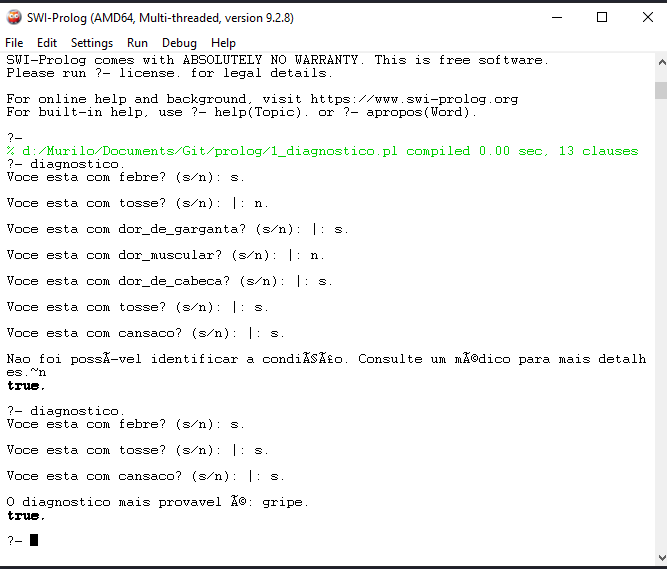
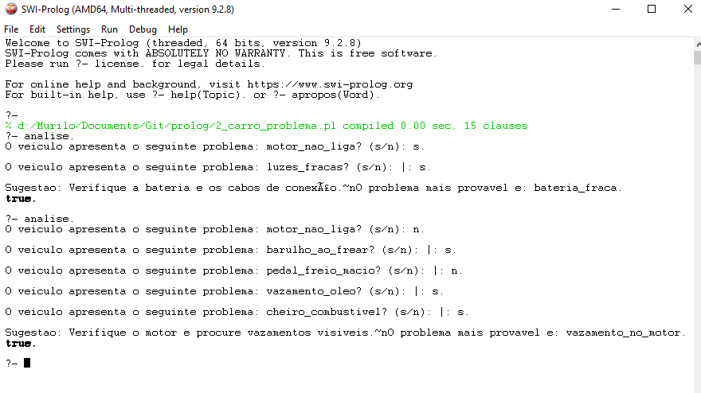
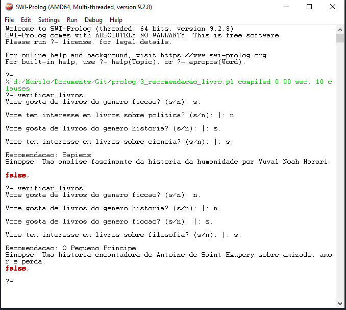
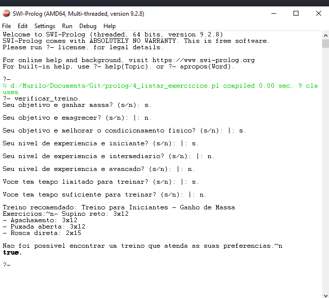
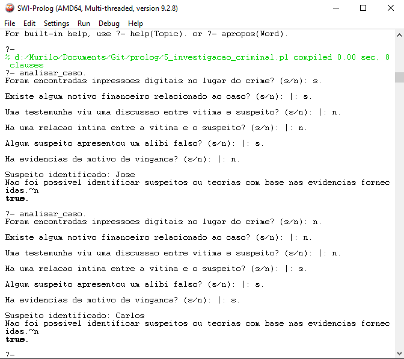

# Trabalho  de Programação Lógica

### Instruções para executar o programa
- Questao 1: `diagnostico.`
    - Evidecia: 
    
- Questao 2: `analise.`
    - Evidecia: 
    
- Questao 3: `verificar_livros.`
    - Evidecia: 
    
- Questao 4: `verificar_treino.`
    - Evidecia: 
    
- Questao 5: `analisar_caso.`
    - Evidecia: 
    

Aluno: **Murilo Costa Bittencourt**